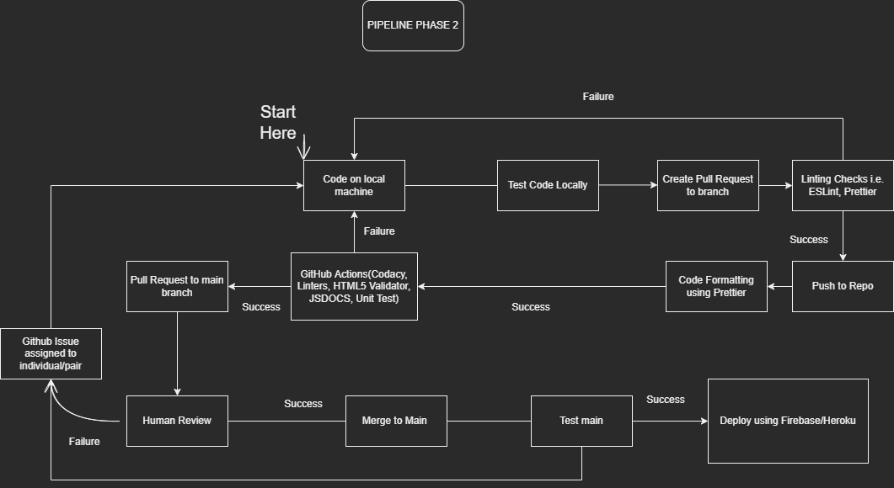

# CI/CD Pipeline Phase 2

## Summary

    This file is a detailed overview of our CI/CD pipeline that has been implemented for this project.

## Pipeline Diagram

---

## Current Status

> ### What is Functional?
>
> The following components are currently functional:
>
> > #### Linting and Formatting
> >
> > - ESLint & Prettier
> >
> > #### Code Coverage Reporting
> >
> > - Codacy Analysis
> > - HTML5 Validator
> >
> > #### Documentation generation
> >
> > - Automated generation via JSDoc
> >
> > #### Unit Testing integration
> >
> > - Unit Tests for pull requests via Jest
> >
> > #### Human Code Quality Review
> >
> > - Peer review for each pull request
> >
> > #### Deployment
> >
> > - Deploy using Firebase/Heroku

> ### What is in Progress?
>
> The following components are in Progress:
>
> > #### Deployment
> >
> > - Fix Firebase/Heroku Deployment issue when combining frontend and backend.

> ### What is Planned?
>
> > #### Code Minification
> >
> > - Implement using Auto Minify

## Descriptions for Implemented Functions

> **Linting and Formattting:**
>
> > - ESLint & Prettier are implemented through GitHub to automatically check committed code for any errors, if they're not automatically fixable then it will return an error.

> **Code Coverage Reporting:**
>
> > - With Codacy and HTML5 Validator integrated into our GitHub, we have it such that for each pull request that Codacy will analyze our source code as well as identify potential problems that currently exist i.e. Duplication, Complexity, etc. We also have HTML5 Validator to check the validity of our HTML files.

> **Documentation Generation:**
>
> > - JSDoc is being used to automatically generate documentations from source.

> **Deployment:**
>
> > - Deployment is currently being run through Firebase.

## CI/CD Pipeline workflow summary

> 1.) Members are assigned tasks to complete locally on seperate branch from main.

> 2.) Write and test locally

> 3.) Once finished create a pull request.

> 4.) Wait for automated testing on GitHub

> 5.) Unit Testing; if succsessful continue, otherwise return to step 2

> 6.) Pull Request to branch

> 7.) Have an individual on your team review your code, if there's a problem return to step 2

> 8.) Merge Pull Request

> 9.) Check for potential problems after merge, if any issues

> 10.) Deploy using Firebase/Heroku
