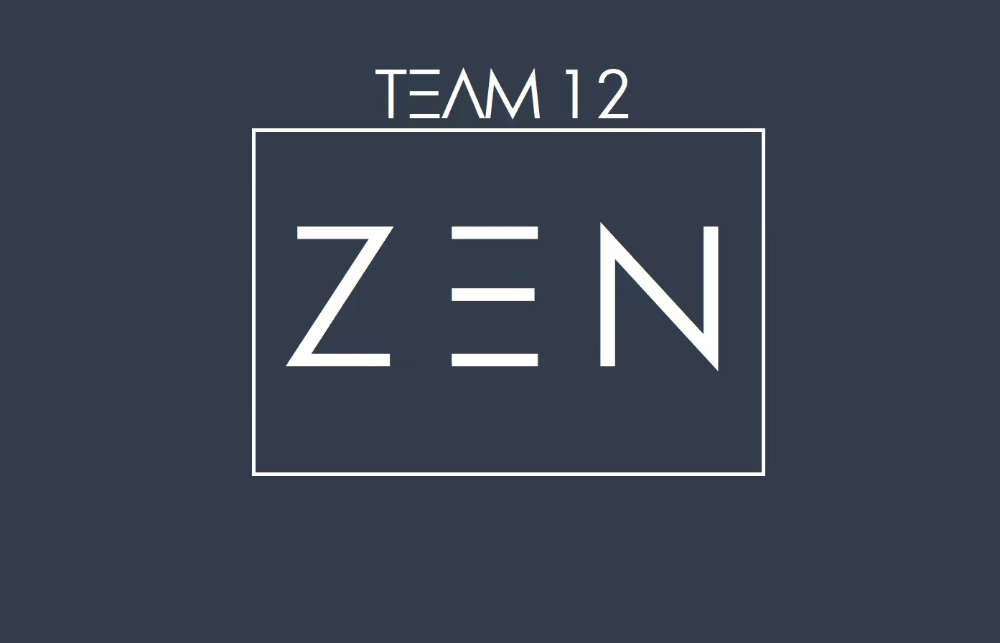

# Team ZEN!

## Members

### [Dor Roter](https://dor-roter.github.io/UCSD-CSE110-A1/)
- Year: Junior
- Major: Computer Science
- Languages: Can speak english Hebrew and Spanish 
- Hometown: Jerusalem, Israel 
- Hobbies: Running, basketball, traveling 
- Random info: Can play the guitar, served 3 years years in the army

### [Jack Yang](http://immmjack.github.io/)

- Year: Junior
- Majors: Computer Science, Math
- Hometown: Ningbo, China (a city 3 hours drive from Shanghai)
- Hobbies: Ultimate Frisbee, Soccer (Real Madrid is my favorite), Piano, Watching Movies, Basketball (Bucks is my favorite)
- Random info: As a fan of Star Wars, I own a light saber and always watch these series with it.

### [Leland Bove](https://lbove27.github.io/LabWeek1CSE110-LelandBove/)
- Year: Junior
- Major: Computer Science
- Hometown: San Carlos, California
- Hobbies: Going to the gym, watching TV, playing video games

### [Natalie Kwong](https://nataliekwong925.github.io/cse110_pages/) (Team Lead)

- Year: Junior
- Major: Cognitive Science - Machine Learning and Neural Computation
- Minor: Computer Science, Urban Studies and Planning
- Hometown: Bay Area, California
- Hobbies: Running, writing, reading, painting
- Random Info: I have chickens, I ran a marathon my freshman year of college

### [Punn Kam](http://punnkam.com/)

- Year: Junior
- Major: Computer Science
- Hometown: Bangkok, Thailand
- Hobbies: Rugby, basketball, crypto, poker

### [Rajdeep Nag](https://rajdepnag.github.io/GitHub_Pages-/)

- Year: Junior
- Major: Computer Engineering
- Hometown: Bangalore, India
- Hobbies: I love art! I play the guitar here and there too. Football (soccer) takes up a majority of my time. Apart from this I love watching movies, anime and TV shows.

### [Sam Zakeri](https://samzak123.github.io/GitHubPages/)

- Year: Senior
- Major: Computer Science
- Hometown: Los Angeles, CA
- Languages: Persian, and can speak Farsi
- Hobbies: I love playing basketball, and watching the NBA. In my free time, I also enjoy exploring the outdoors.

### [Tarek Tarif](https://ttarif1.github.io/Github_Pages_Project/)

- Year: Senior
- Major: Mathematics-Computer Science
- Minor: Computer Engineering
- Hometown: Irvine, California
- Hobbies: Basketball, Gaming, Debating, Traveling, Reading

### [Tyler He](https://tyhe0165.github.io/cse110/)

- Year: Senior
- Major: Computer Science
- Languages: Can speak English and Cantonese
- Hometown: San Francisco, CA
- Hobbies: Running, shooting pool, video games
- Random info: Double jointed, can't play instruments, used to compete in jigsaw puzzle tournaments and won once

